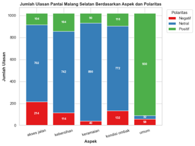
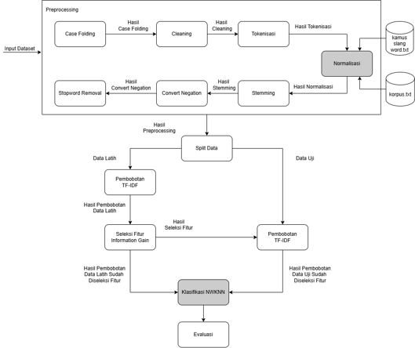
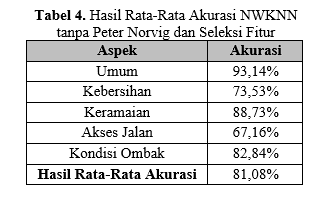
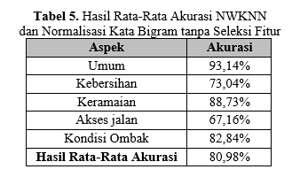
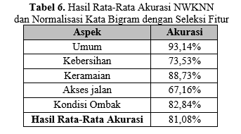
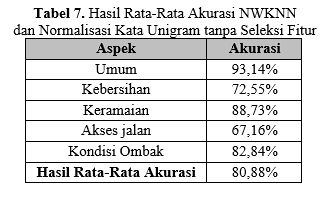
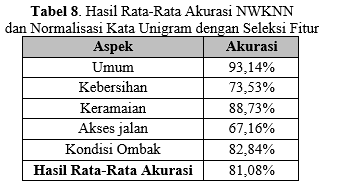
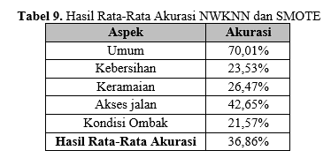
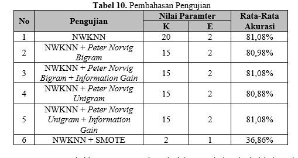

# 🏖️ ABSA-NWKNN: Analisis Sentimen Berbasis Aspek Ulasan Wisata

<!-- Badges (Pemanis Visual) -->

  <!-- Library Data Science -->
  
  
  
  
  <!-- Environment (Pilih salah satu) -->
  
  

> Penerapan algoritma **_Neighbor Weighted K-Nearest Neighbor_ (NWKNN)** untuk menangani ketidakseimbangan data pada Analisis Sentimen Berbasis Aspek (ABSA) terhadap ulasan objek wisata Pantai Malang Selatan.

<!-- Tempatkan gambar banner atau alur penelitian Anda di bawah ini -->
<!-- 

 -->

---

## 📌 Deskripsi Proyek

Penelitian ini bertujuan untuk menguji performa dan akurasi algoritma **NWKNN** dalam mengklasifikasikan teks ulasan. Fokus utama proyek ini adalah menangani tantangan _imbalanced dataset_ (data tidak seimbang) dengan menggunakan **Neighbor Weighted K-Nearest Neighbor**. Lalu membandingkannya terhadap teknik _Synthetic Minority Over-sampling Technique_ (**SMOTE**) dan beberapa macam pengujian untuk melihat pengaruh seleksi fitur hingga penerapan perbaikan kata menggunakan Metode **Spelling Corector Peter Norvig**.

---

## 📊 Dataset

Data yang digunakan merupakan teks ulasan mentah (_raw review_) dari wisatawan mengenai destinasi Pantai Malang Selatan.

- **Total Data:** 1.020 ulasan wisatawan.
- **Karakteristik Label:** Multi-label (ditransformasikan menjadi _single-label_ menggunakan pendekatan _Binary Relevance_ sebelum proses pelatihan model).

---

## ⚙️ Arsitektur Model

### 1. Preprocessing Teks

Setiap ulasan diproses melalui serangkaian tahapan pembersihan untuk menstandarisasi teks:

1.  _Case Folding_ (Keseragaman huruf kecil)
2.  _Cleaning_ (Pembersihan tanda baca & karakter khusus)
3.  _Tokenisasi_ (Pemotongan kata)
4.  **Normalisasi Kata** (Menerapkan metode Peter Norvig pada level _Unigram_ & _Bigram_)
5.  _Stemming_ (Pemotongan imbuhan menjadi kata dasar)
6.  _Convert Negation_ (Penanganan kata sangkalan seperti "tidak bagus" -> "jelek")
7.  _Stopword Removal_ (Penghapusan kata hubung yang tidak bermakna)

### 2. Ekstraksi & Seleksi Fitur

- **Ekstraksi Fitur:** Menggunakan **TF-IDF** (_Term Frequency-Inverse Document Frequency_) untuk pembobotan kata.
- **Seleksi Fitur:** Menerapkan **Information Gain (IG)** untuk menyaring fitur kata yang paling relevan terhadap kelas target, sehingga komputasi menjadi lebih efisien.

### 3. Pemodelan & Klasifikasi

- **Algoritma Utama:** Neighbor Weighted K-Nearest Neighbor (NWKNN).
- **Penyeimbang Data:** SMOTE (Digunakan pada salah satu skenario untuk menganalisis dampaknya terhadap kelas minoritas).
- **Transformasi Label:** Binary Relevance.

---

## 🏆 Hasil Pengujian & Akurasi

Model diuji menggunakan berbagai skenario kombinasi (dengan/tanpa normalisasi, penggunaan _Information Gain_, variasi penyeimbangan data, serta penyesuaian parameter `k` dan `e`).

 
 
 

---

## 📈 Pembahasan Pengujian

Berdasarkan tabel di atas, terlihat adanya anomali di mana penggunaan **SMOTE** justru menyebabkan penurunan tingkat akurasi secara drastis (menjadi 36,86%).

Penurunan ini disebabkan oleh karakteristik sampel sintetis (data buatan) dari kelas minoritas yang digenerasi oleh SMOTE. Sampel sintetis tersebut tercipta terlalu berdekatan—atau bahkan saling tumpang tindih—dengan batas sampel dari kelas mayoritas. Kondisi ini menciptakan **_noise_ (gangguan)** baru pada data. Selain itu, distribusi sampel buatan ini meningkatkan kompleksitas data latih yang berisiko memicu **_overfitting_**, sehingga kemampuan model dalam menggeneralisasi data uji (data yang belum pernah dilihat sebelumnya) menjadi sangat lemah.

Pengunaan SMOTE menyebabkan penurunan akurasi oleh sampel sintetis dari kelas minoritas yang dihasilkan terlalu dekat. Namun, penggunaan SMOTE membantu menyeimbangkan distribusi kelas, sehingga prediksi model menjadi lebih merata dan tidak hanya cenderung ke kelas mayoritas. Sebaliknya NWKNN, cenderung memprediksi kelas mayoritas akibat ketidakseimbangan jumlah data pada kelas tersebut. Semakin kecil nilai E, maka bobot yang dihasilkan juga semakin rendah. Hal ini berdampak pada penurunan skor klasifikasi, karena nilai bobot yang kecil mengurangi kontribusi tetangga terdekat dalam proses pengklasifikasian.

---

## 🎯 Kesimpulan & Saran

### Kesimpulan

Meskipun teknik SMOTE menurunkan metrik akurasi secara keseluruhan akibat efek _noise_, implementasi metode ini **berhasil memaksa model untuk mengenali dan memprediksi kelas minoritas**. Hal ini sangat kontras dengan pemodelan NWKNN murni (tanpa SMOTE), di mana model cenderung bias dan selalu memprediksi kelas mayoritas akibat distribusi data bawaan yang sangat timpang.

### Saran Pengembangan Lanjut

1.  **Peningkatan Normalisasi:** Mengembangkan atau mengintegrasikan metode normalisasi kata yang lebih canggih, yang mampu mengoreksi kesalahan pengetikan (_typo_) dengan jarak toleransi edit (_edit distance_) lebih dari 2 karakter.
2.  **Eksplorasi Metode _Resampling_:** Menerapkan metode penyeimbangan data alternatif selain SMOTE untuk membandingkan efektivitasnya dalam menangani batas kelas yang tumpang tindih. Rekomendasi metode yang dapat diuji pada penelitian selanjutnya adalah:
    - **ADASYN** (_Adaptive Synthetic Sampling_)
    - **SMOTE-Tomek Links** (Pendekatan hibrida _oversampling_ dan _undersampling_)

---
